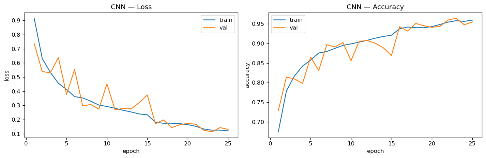
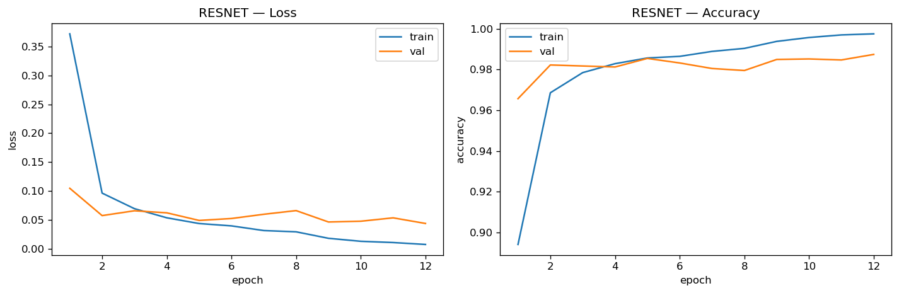
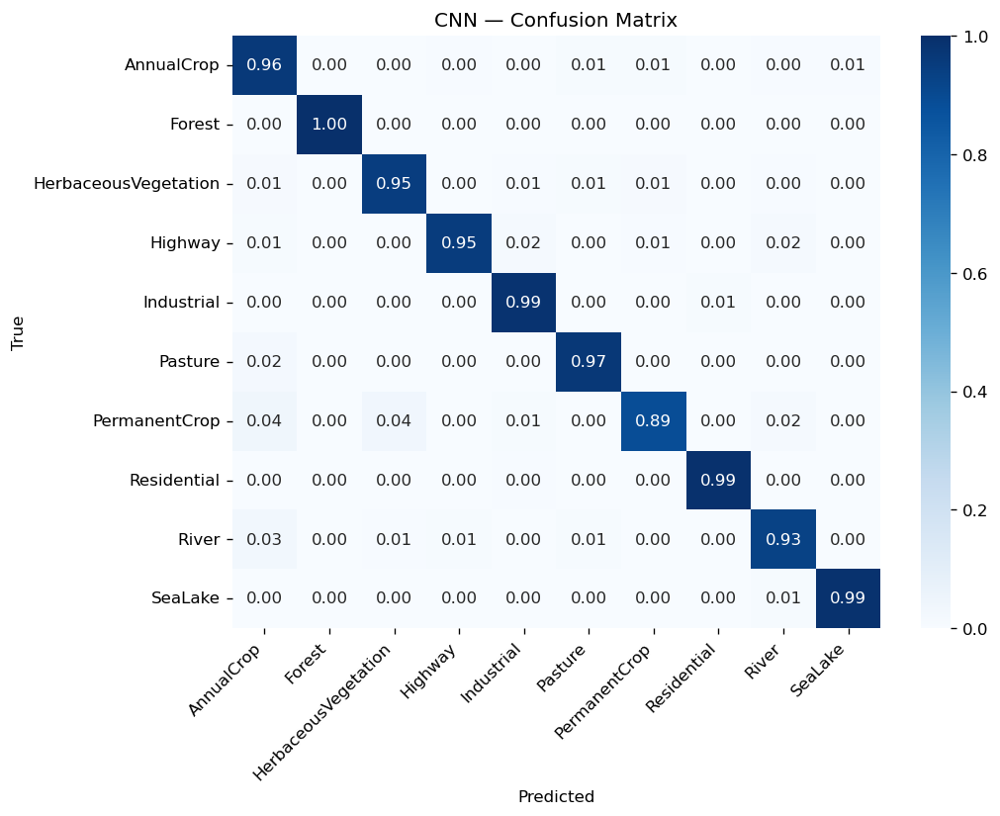
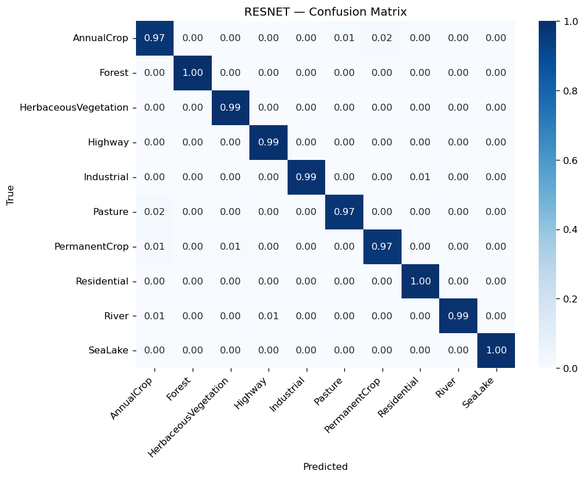
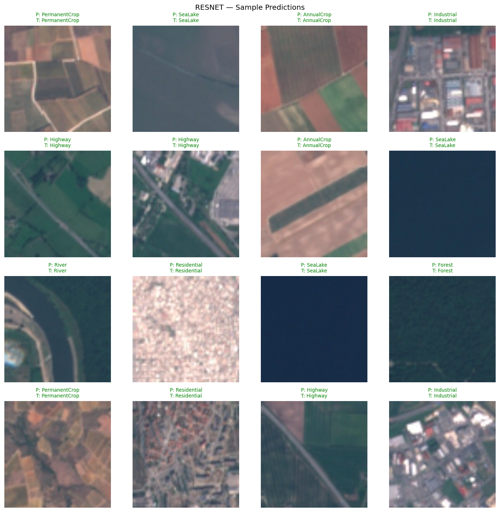
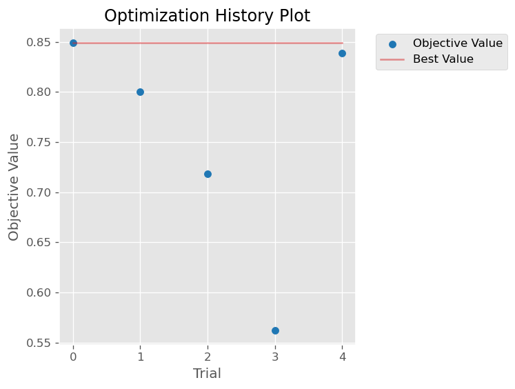
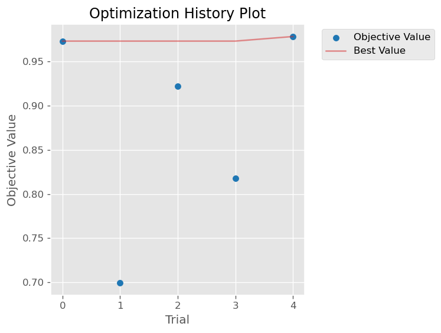

# 🛰️ EuroSAT Land-Use Classification — Custom CNN vs. ResNet50 (Transfer Learning)

> MSc in **Artificial Intelligence & Visual Computing (AIVC)** — University of West Attica
> Assignment (*Ergasia*) 2026 — Image Classification

## 1. Problem description

[EuroSAT](https://github.com/phelber/EuroSAT) is a benchmark dataset of **Sentinel-2**
satellite images for **land-use / land-cover (LULC) classification**. It contains
**27,000 RGB images** of **64×64** pixels, evenly spread across **10 classes**:

`AnnualCrop`, `Forest`, `HerbaceousVegetation`, `Highway`, `Industrial`, `Pasture`,
`PermanentCrop`, `Residential`, `River`, `SeaLake`.

The goal of this project is to **train, analyse and compare at least two different deep
learning models** for this classification task, evaluating their performance,
capabilities and limitations.

**Dataset source — downloads automatically, no token or account needed.** The code fetches
the public **Zenodo** archive
[`EuroSAT_RGB.zip`](https://zenodo.org/records/7711810) (~95 MB) using only the Python
standard library. *(A Kaggle fallback —
[`apollo2506/eurosat-dataset`](https://www.kaggle.com/datasets/apollo2506/eurosat-dataset) —
is available via `download_dataset(source="kaggle")` but is **not** required.)*

## 2. The Idea (methodology)

To contrast two of the approaches suggested in the assignment, we implement and compare:

| # | Model | Approach | Why |
|---|-------|----------|-----|
| 1 | **Custom CNN** | Trained **from scratch** | A compact, purpose-built VGG-style network (4 conv blocks) — a strong, lightweight baseline designed specifically for 64×64 tiles. |
| 2 | **ResNet50** | **Transfer learning + fine-tuning** | A deep backbone pre-trained on ImageNet, with a new classifier head and full fine-tuning — leverages learned visual features for higher accuracy and faster convergence. |

**Pipeline (identical for both models for a fair comparison):**

1. **Data** — download via `kagglehub`, build a **reproducible stratified 70/15/15**
   train/validation/test split (seed = 42).
2. **Augmentation** — random horizontal/vertical flips and ±15° rotation (satellite
   tiles are orientation-agnostic). The CNN uses native 64×64 with EuroSAT
   normalization; ResNet50 resizes to 224×224 with ImageNet normalization.
3. **Training** — `CrossEntropyLoss`, Adam, `ReduceLROnPlateau` scheduler, best
   checkpoint selected by validation accuracy.
4. **Hyperparameter optimization** — **Optuna (5 trials)** tunes learning rate,
   dropout, batch size and optimizer; the best configuration is used to retrain the
   final model.
5. **Evaluation** — accuracy + per-class precision/recall/F1, **confusion matrix**,
   and a **sample-prediction grid** on the held-out test set.

## 3. Repository structure

```
.
├── README.md
├── requirements.txt
├── src/
│   ├── config.py      # paths, class names, normalization, hyperparameters
│   ├── data.py        # download, transforms, stratified split, dataloaders
│   ├── models.py      # CustomCNN + ResNet50 (transfer learning)
│   ├── train.py       # training loop + history tracking + checkpointing
│   ├── tune.py        # Optuna hyperparameter search (5 trials)
│   ├── evaluate.py    # metrics, confusion matrix, prediction grids
│   └── utils.py       # reproducibility + plotting helpers
├── notebooks/
│   └── EuroSAT_Classification.ipynb   # end-to-end, Colab-ready
└── results/           # generated figures + metrics (committed)
```

## 4. Installation & how to run

### Option A — Google Colab (recommended)

1. Open `notebooks/EuroSAT_Classification.ipynb` in
   [Google Colab](https://colab.research.google.com/) and select a **GPU** runtime
   (*Runtime → Change runtime type → GPU*).
2. **Runtime → Run all.** No credentials needed — the dataset downloads automatically
   from Zenodo. The notebook then trains both models, runs the Optuna search, and renders
   all curves, confusion matrices and prediction grids.

### Option B — Local

```bash
# 1. (optional) create a virtual environment
python -m venv .venv && source .venv/bin/activate   # Windows: .venv\Scripts\activate

# 2. install dependencies
pip install -r requirements.txt

# 3. train each model (the dataset auto-downloads from Zenodo on first run — no token)
python -m src.train --model cnn
python -m src.train --model resnet

# 4. tune hyperparameters with Optuna (5 trials)
python -m src.tune --model cnn

# 5. evaluate on the test set (writes metrics + figures to results/)
python -m src.evaluate --model cnn
python -m src.evaluate --model resnet
```

> **Note on compute:** training the full models and the Optuna search is GPU-intensive.
> A GPU (Colab or local CUDA) is strongly recommended. For a quick pipeline check on
> CPU, run with `--epochs 1`.

## 5. Results

> 📄 A self-contained written report with all tables and figures is available at
> [`EuroSAT_Analysis_Report.pdf`](EuroSAT_Analysis_Report.pdf) (regenerate any time with
> `python scripts/make_report.py`).

> All figures and metrics below are **real measured results** generated into `results/` by running
> the full pipeline on an **NVIDIA RTX 3060 (12 GB)** — CUDA 12.8 / PyTorch 2.10. The 27,000 images
> were split with the reproducible stratified 70/15/15 partition (seed = 42) →
> **18,900 train / 4,050 val / 4,050 test**.

### Training curves

| Custom CNN | ResNet50 |
|---|---|
|  |  |

### Confusion matrices

| Custom CNN | ResNet50 |
|---|---|
|  |  |

### Sample predictions (green = correct, red = wrong)

| Custom CNN | ResNet50 |
|---|---|
|  |  |

### Optuna hyperparameter search (5 trials each)

| Custom CNN | ResNet50 |
|---|---|
|  |  |

Best configuration found per model (full tables in
[`optuna_cnn_trials.csv`](results/optuna_cnn_trials.csv) /
[`optuna_resnet_trials.csv`](results/optuna_resnet_trials.csv)):

| Model | lr | dropout | batch size | optimizer | val acc (5-epoch trial) |
|-------|-----|---------|-----------|-----------|--------------------------|
| Custom CNN | 5.61e-4 | 0.580 | 32 | adam | 0.849 |
| ResNet50 | 1.53e-3 | 0.219 | 32 | sgd | 0.978 |

> The search optimizes validation accuracy over short 5-epoch trials; the final models above are
> trained for the full schedule using the sensible defaults in `src/config.py`.

### Summary table

| Model | Approach | Test accuracy | Macro F1 | Trainable params | Epoch time |
|-------|----------|---------------|----------|------------------|------------|
| Custom CNN | from scratch | **0.9632** | 0.9621 | 457,738 (≈0.46M) | ~5.3 s |
| ResNet50 | transfer learning + fine-tuning | **0.9874** | 0.9870 | 23,528,522 (≈23.5M) | ~125 s |

Best validation accuracy reached during training: **CNN 0.9640** (epoch 23 of 25),
**ResNet50 0.9874** (epoch 12 of 12). ResNet50 converges to >0.98 val accuracy in a **single epoch**,
confirming the value of ImageNet transfer learning on this task.

## 6. Comparison, capabilities & limitations

**Custom CNN (from scratch)**
- ✅ Lightweight (**457K params**, ~51× fewer than ResNet50), ~5 s/epoch, low memory — runs on modest hardware.
- ✅ Operates on native 64×64 tiles (no upscaling needed).
- ✅ Still reaches a strong **96.3%** test accuracy from scratch.
- ⚠️ Lower ceiling on accuracy; must learn all visual features from limited data.
- ⚠️ More sensitive to augmentation/regularization choices.

**ResNet50 (transfer learning + fine-tuning)**
- ✅ Highest accuracy (**98.7%** test, +2.4 pts over the CNN); ImageNet features transfer well to satellite imagery.
- ✅ Converges fast — >0.98 val accuracy after a single fine-tuning epoch.
- ⚠️ ~23.5M parameters; ~24× slower per epoch (~125 s), heavier memory/inference.
- ⚠️ Requires upscaling 64×64 → 224×224 and ImageNet normalization.

**Typical confusions (measured, lowest per-class recall):**
- **Custom CNN:** `PermanentCrop` (0.89), `River` (0.93), `HerbaceousVegetation` (0.95) — these crop/vegetation
  classes are the hardest, mostly confused with `AnnualCrop` / `Pasture` (see `cnn_confusion_matrix.png`).
- **ResNet50:** much flatter — worst classes are `PermanentCrop`, `AnnualCrop`, `Pasture`, all still ≥0.97 recall.

Both models share the same failure mode: semantically/visually similar land-cover classes
(`PermanentCrop` ↔ `AnnualCrop`, `HerbaceousVegetation` ↔ `Pasture`), as expected for 64×64 satellite tiles.

## 7. Reproducibility

All randomness is seeded (`SEED = 42` in `src/config.py`): the stratified split and
training are deterministic, so reruns produce the same partition and comparable metrics.

## 8. License & acknowledgements

- EuroSAT: Helber et al., *"EuroSAT: A Novel Dataset and Deep Learning Benchmark for Land
  Use and Land Cover Classification"*, IEEE JSTARS, 2019.
- Built with [PyTorch](https://pytorch.org/), [torchvision](https://pytorch.org/vision/),
  [scikit-learn](https://scikit-learn.org/) and [Optuna](https://optuna.org/).
